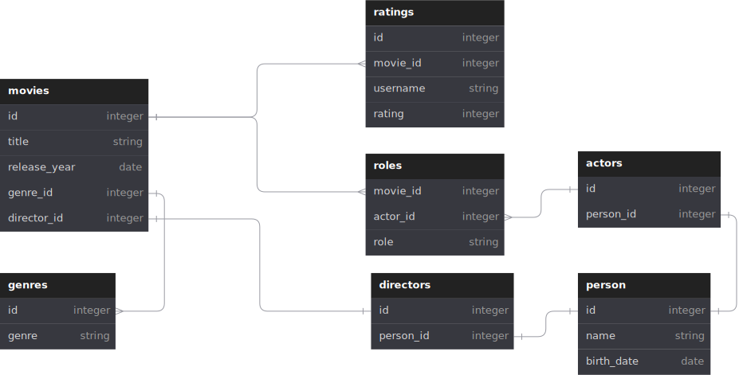

# MoviesDB

## My project for the Databases II. course

Database architecture

### Installation

- Create schema -> run `./sys/create_movie_manager_schema.sql`
- Create database -> `cd ./movie_manager` and run `install_all.sql`
